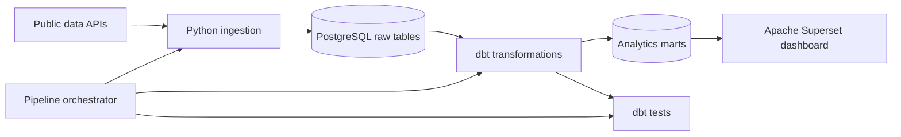

# Weather Conditions, Mortality and Traffic Accidents in Estonia

## Project overview

In this project, I will build an end-to-end data pipeline and analytical dashboard to explore whether weather conditions are associated with weekly mortality and traffic-accident patterns in Estonia.

The project is descriptive. It may reveal patterns and statistical associations, but it will not establish that weather causes changes in mortality or traffic accidents.

## The project investigates the following main question:

What patterns and associations exist between weather conditions, traffic accidents, and mortality in Estonia?

1. Are unusual weather conditions associated with increased numbers of traffic accidents in Estonia?
2. Does weekly mortality differ between weeks with unusual and typical weather conditions?
3. Do mortality patterns occur during the same periods as unusual weather conditions?

These questions concern association and comparison, not causality.

### Architecture



### Data sources

| Source | Dataset | Format | Expected update frequency | Purpose |
|---|---|---|---|---|
| Statistics Estonia | RV035 weekly deaths | JSON-stat2 | Weekly | Preliminary weekly mortality counts by sex and age group |
| Estonian Environment Agency / Environmental Portal | Daily climate observations | JSON | Daily | Temperature, precipitation, sunshine and other weather observations by station |
| Estonian Transport Administration | Personal-injury traffic accidents | CSV | Weekly | Accident events and numbers of injured and killed people |

Source links:

- [Statistics Estonia: RV035](https://andmed.stat.ee/et/stat/rahvastik__rahvastikusundmused__surmad/RV035/table/tableViewLayout2)
- [Environmental data services](https://keskkonnaportaal.ee/et/avaandmed/keskkonna-ja-ilma-valdkonna-andmeteenused)
- [Traffic accidents involving personal injury](https://andmed.eesti.ee/datasets/inimkannatanutega-liiklusonnetuste-andmed)


A detailed description and the reasoning behind each component are available in [docs/architecture.md](docs/architecture.md).

### Tools

| Responsibility | Technology | Reason for using it |
|---|---|---|
| Environment and services | Docker Compose | Makes the project reproducible and keeps services isolated |
| Data ingestion | Python | Supports API requests, CSV/JSON parsing and database loading |
| Data storage | PostgreSQL | Stores raw and transformed relational data |
| Data transformation | dbt and SQL | Makes transformation logic modular, documented and testable |
| Orchestration | Python pipeline orchestrator | Runs ingestion, transformation and tests in the correct order |
| Data quality | dbt tests | Detects missing values, duplicates, invalid ranges and grain violations |
| Visualisation | Apache Superset | Provides an open-source dashboard connected to PostgreSQL |

### Repository structure

```text
.
├── README.md                  # Project overview, results and setup instructions
├── compose.yml                # Docker Compose service definitions
├── .env.example               # Example environment configuration
├── dbt-requirements.txt       # Python dependencies required by dbt
├── dbt_project.yml            # dbt project configuration
├── profiles.yml               # dbt PostgreSQL connection configuration
├── superset_config.py         # Local Apache Superset configuration
├── docker/                    # Custom Docker images and container configuration
├── docs/                      # Additional project documentation
├── macros/                    # Reusable dbt SQL macros
├── models/
│   ├── staging/               # Source cleaning and type standardisation
│   ├── intermediate/          # Historical calculations and weekly aggregation
│   └── marts/                 # Facts, dimensions and analytical marts
├── orchestrator/              # Pipeline orchestration logic
├── scripts/                   # Python data-ingestion scripts
├── seeds/                     # Small static reference datasets
├── tests/                     # Custom dbt data-quality tests
└── superset_exports/          # Exported Superset dashboard ZIP files
```

Generated logs, temporary files and dbt build artifacts such as `target/` are not committed to the repository.

## Data pipeline

The pipeline runs in the following order:

1. load or refresh the three source datasets;
2. load static reference data with `dbt seed`;
3. run dbt transformations;
4. run dbt data-quality tests;
5. make the validated analytical marts available to Apache Superset.

The pipeline stops if a critical ingestion, transformation or test step fails. This prevents failed or incomplete source loads from silently producing analytical results that appear current.

### Data-model layers

- **Raw:** source data stored with minimal transformation before analytical processing.
- **Staging:** renamed and typed fields, normalized labels and source-specific cleaning.
- **Intermediate:** daily and weekly aggregations, geographic alignment, historical averages and deviation calculations.
- **Marts:** reusable fact and dimension models together with final analytical datasets used by the dashboard.

### Data-quality principles

The project includes checks for:

- required fields and valid data types;
- duplicate natural keys;
- valid ISO week and date ranges;
- non-negative counts and measurements where applicable;
- uniqueness of the declared model grain;
- weather-station and county mapping coverage;
- validity of joins between dimensions, facts and analytical models;
- incomplete or insufficient historical periods used in weather comparisons.

### Dashboard Superset

#### Running the project locally

Install: Docker Desktop

1. Download the project

2. In terminal (for Windows only):
```bash
copy .env.example .env
docker compose up -d db
docker compose run --rm pipeline  # Run the full data pipeline
docker compose up -d --build superset
```
3. Open http://localhost:8088  <!-- passwords in .env -->

4. Import the dashboard:
Dashboards - Import dashboard - Select the dashboard ZIP file from superset_exports/

```bash
docker compose down  # Stop the project
```

## **Conclusion**

Across all available years (2020–2026), unusual weather conditions were not consistently associated with higher traffic accident counts or higher weekly mortality. Differences between typical and unusual weather varied by month, and the observed associations were not strong or consistent enough to conclude that weather conditions have a strong impact on traffic accidents or mortality.


### Privacy and security

The project uses public statistical and event data. It does not require names, personal identification codes, home addresses or other direct personal identifiers.

Credentials and connection settings are stored in a local `.env` file. Only `.env.example`, containing placeholder values, may be committed. The real `.env` file, database files, logs and generated build artifacts must remain outside version control.

### Limitations

- The analysis is observational and cannot establish causality.
- Mortality data cannot be analysed by county with the selected source.
- Weather-station coverage may differ between counties and periods.
- Recent mortality values are preliminary.
- A limited historical period may make same-week averages unstable.
- Weekly aggregation can hide short-lived weather events.
- Associations may be affected by seasonality, population change and other confounding factors.


