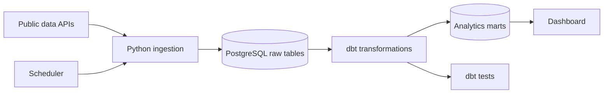

# Weather Conditions, Mortality and Traffic Accidents in Estonia

## Project overview

In this project, I will build an end-to-end data pipeline and analytical dashboard to explore whether weather conditions are associated with weekly mortality and traffic-accident patterns in Estonia.

The analysis may focus on temperature, precipitation and sunshine. Mortality will be examined by sex and age group at the national level. Traffic accidents will be examined by county.

The project is descriptive. It may reveal patterns and statistical associations, but it will not establish that weather causes changes in mortality or traffic accidents.

## Main objective

My objective is to create a reproducible pipeline that:

1. downloads public data from Estonian sources;
2. stores the source data in PostgreSQL;
3. cleans and transforms the data with dbt;
4. validates the data with automated tests;
5. prepares analysis-ready datasets at a weekly level;
6. presents the results in an interactive dashboard.

## Research questions

What patterns and associations exist between weather conditions, traffic accidents, and mortality in Estonia?

The project will address the following questions:

1) Are unusual or hazardous weather conditions associated with increased numbers of traffic accidents and injuries in Estonia?
2) Does weekly mortality differ between weeks with hazardous and typical weather conditions?
3) Do mortality patterns occur during the same week as hazardous weather conditions?

These questions concern association and comparison, not causality.

## Scope and level of detail

| Subject | Main grain | Available breakdowns |
|---|---|---|
| Mortality | ISO week, national level | Sex and age group |
| Traffic accidents | ISO week and county | Accident, injury and fatality counts |
| Weather | Day and station initially; ISO week for analysis | Station, county and national level |

The mortality source does not contain a county field. Therefore, mortality and weather can be joined only at the national weekly level. Traffic accidents and weather can be joined at the county-week level.

## Data sources

| Source | Dataset | Format | Expected update frequency | Purpose |
|---|---|---|---|---|
| Statistics Estonia | RV035 weekly deaths | JSON-stat2 | Weekly | Preliminary weekly mortality counts by sex and age group |
| Estonian Environment Agency / Environmental Portal | Daily climate observations | JSON | Daily or source-dependent | Temperature, precipitation, sunshine and other weather observations by station |
| Estonian Transport Administration | Personal-injury traffic accidents | CSV | Source-dependent | Accident events and numbers of injured and killed people |

Source links:

- [Statistics Estonia: RV035](https://andmed.stat.ee/et/stat/rahvastik__rahvastikusundmused__surmad/RV035/table/tableViewLayout2)
- [Environmental data services](https://keskkonnaportaal.ee/et/avaandmed/keskkonna-ja-ilma-valdkonna-andmeteenused)
- [Traffic accidents involving personal injury](https://andmed.eesti.ee/datasets/inimkannatanutega-liiklusonnetuste-andmed)

## Planned architecture



A detailed description and the reasoning behind each component are available in [docs/architecture.md](docs/architecture.md).

## Planned technology stack

| Responsibility | Technology | Reason for using it |
|---|---|---|
| Environment and services | Docker Compose | Makes the project reproducible and keeps services isolated |
| Data ingestion | Python | Supports API requests, CSV/JSON parsing and database loading |
| Data storage | PostgreSQL | Stores raw and transformed relational data |
| Data transformation | dbt and SQL | Makes transformation logic modular, documented and testable |
| Orchestration | A lightweight scheduler | Runs ingestion, transformation and tests in the correct order |
| Data quality | dbt tests | Detects missing values, duplicates, invalid ranges and grain violations |
| Visualisation | Apache Superset | Provides an open-source dashboard connected to PostgreSQL |

## Planned repository structure

```text
.
├── README.md                  # Project overview and setup instructions
├── compose.yml               # Local service definitions
├── .env.example              # Required environment-variable names only
├── dbt_project.yml           # dbt project configuration
├── profiles.yml              # dbt connection configuration
├── docker/                   # Custom container images
├── docs/
│   ├── architecture.md       # Architecture and design decisions
│   └── transformation.md     # Model grains and transformation rules
├── macros/                   # Reusable dbt SQL macros
├── models/
│   ├── staging/              # Type conversion and source cleaning
│   ├── intermediate/         # Alignment and weekly aggregation
│   └── marts/                # Dimensions, facts and final analytical tables
├── orchestrator/             # Scheduling and pipeline execution
├── scripts/                  # Python ingestion scripts
├── seeds/                    # Small static reference datasets
├── tests/                    # Custom data-quality tests
└── dashboard/                # Dashboard export and related documentation
```

Generated logs and dbt build artifacts will not be committed to the repository.

## Data pipeline

The planned execution order is:

1. load or refresh the three source datasets;
2. load static reference data with `dbt seed`;
3. run dbt transformations;
4. run dbt data-quality tests;
5. make the validated marts available to the dashboard.

The pipeline should stop when a critical ingestion, transformation or test step fails. A failed source load must not silently produce a dashboard that appears current.

## Data-model layers

- **Raw:** source data stored with minimal changes and ingestion metadata.
- **Staging:** renamed and typed fields, normalized labels and source-specific cleaning.
- **Intermediate:** station-to-county mapping, daily and weekly aggregations, and historical comparison logic.
- **Marts:** reusable dimensions and facts plus final datasets designed for the dashboard.

## Data-quality principles

The project will include checks for:

- required fields and valid data types;
- duplicate natural keys;
- valid ISO week and date ranges;
- non-negative counts and measurements where applicable;
- uniqueness of every model's declared grain;
- weather-station and county mapping coverage;
- source freshness and incomplete current periods.

## Privacy and security

The project uses public statistical and event data. It does not require names, personal identification codes, home addresses or other direct personal identifiers.

Credentials and connection settings will be stored in a local `.env` file. Only `.env.example`, containing placeholder values, may be committed. The real `.env` file, database files, logs and generated build artifacts must remain outside version control.

## Limitations

- The analysis is observational and cannot establish causality.
- Mortality data cannot be analysed by county with the selected source.
- Weather-station coverage may differ between counties and periods.
- Recent mortality values may be preliminary.
- A short historical period may make same-week averages unstable.
- Weekly aggregation can hide short-lived weather events.
- Associations may be affected by seasonality, population change and other confounding factors.

## Success criteria

I will consider the first version complete when:

- the project can be started from documented instructions;
- all three sources load reproducibly;
- dbt builds both final analytical marts;
- critical data-quality tests pass;
- the dashboard uses the validated marts;
- the limitations and analytical definitions are documented.

