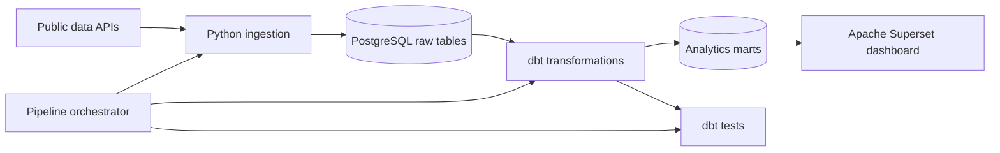

# Ilmastikutingimused, suremus ja liiklusõnnetused Eestis

## Projekti ülevaade

Selles projektis loon tervikliku andmepipeline'i ja analüütilise dashboardi, et uurida, kas ilmastikutingimused on seotud iganädalase suremuse ja liiklusõnnetuste mustritega Eestis.

Projekt on kirjeldav. See võib tuua esile mustreid ja statistilisi seoseid, kuid ei võimalda järeldada, et ilm põhjustab muutusi suremuses või liiklusõnnetustes.

## Projekt uurib järgmist põhiküsimust:

Millised mustrid ja seosed esinevad ilmastikutingimuste, liiklusõnnetuste ja suremuse vahel Eestis?

1. Kas ebatavalised ilmastikutingimused on seotud suurema liiklusõnnetuste arvuga Eestis?
2. Kas iganädalane suremus erineb ebatavaliste ja tavapäraste ilmastikutingimustega nädalate vahel?
3. Kas suremuse mustrid esinevad samadel perioodidel kui ebatavalised ilmastikutingimused?

Need küsimused käsitlevad seoseid ja võrdlust, mitte põhjuslikkust.

### Arhitektuur



### Andmeallikad

| Source | Dataset | Format | Expected update frequency | Purpose |
|---|---|---|---|---|
| Statistics Estonia | RV035 weekly deaths | JSON-stat2 | Iganädalane | Esialgsed iganädalased surmajuhtumite arvud soo ja vanuserühma järgi |
| Estonian Environment Agency / Environmental Portal | Daily climate observations | JSON | Igapäevane | Temperatuur, sademed, päikesepaiste ja muud ilmavaatlused jaamade kaupa |
| Estonian Transport Administration | Personal-injury traffic accidents | CSV | Iganädalane | Liiklusõnnetused ning vigastatute ja hukkunute arv |

Allikate lingid:

- [Statistics Estonia: RV035](https://andmed.stat.ee/et/stat/rahvastik__rahvastikusundmused__surmad/RV035/table/tableViewLayout2)
- [Environmental data services](https://keskkonnaportaal.ee/et/avaandmed/keskkonna-ja-ilma-valdkonna-andmeteenused)
- [Traffic accidents involving personal injury](https://andmed.eesti.ee/datasets/inimkannatanutega-liiklusonnetuste-andmed)

### Tööriistad

| Valdkond | Tehnoloogia | Kasutamise põhjus |
|---|---|---|
| Keskkond ja teenused | Docker Compose | Muudab projekti korratavaks ja hoiab teenused eraldatuna |
| Andmete laadimine | Python | Toetab API-päringuid, CSV/JSON-i töötlemist ja andmete laadimist andmebaasi |
| Andmete salvestamine | PostgreSQL | Salvestab toorandmed ja teisendatud relatsioonilised andmed |
| Andmete transformatsioon | dbt ja SQL | Muudab teisendusloogika modulaarseks, dokumenteerituks ja testitavaks |
| Orkestreerimine | Python pipeline orchestrator | Käivitab andmete laadimise, teisendused ja testid õiges järjekorras |
| Andmekvaliteet | dbt tests | Tuvastab puuduvad väärtused, duplikaadid, vigased vahemikud ja grain’i rikkumised |
| Visualiseerimine | Apache Superset | Pakub avatud lähtekoodiga dashboard’i, mis on ühendatud PostgreSQL-iga |


### Repositooriumi struktuur

```text
.
├── README.md                  # Project overview, results and setup instructions
├── README_EST.md              # Project documentation in Estonian
├── dashboard_image.png        # Dashboard preview image
├── compose.yml                # Docker Compose service definitions
├── .env.example               # Example environment configuration
├── .gitignore                 # Files and directories excluded from Git
├── .dockerignore              # Files excluded from Docker build context
├── .gitattributes             # Git attributes configuration
├── dbt-requirements.txt       # Python dependencies required by dbt
├── dbt_project.yml            # dbt project configuration
├── profiles.yml               # dbt PostgreSQL connection configuration
├── superset_config.py         # Local Apache Superset configuration
├── init.sh                    # Project initialisation script
├── docker/                    # Custom Docker images and container configuration
├── macros/                    # Reusable dbt SQL macros
├── models/
│   ├── staging/               # Source cleaning and type standardisation
│   ├── intermediate/          # Historical calculations and weekly aggregation
│   └── marts/                 # Facts, dimensions and analytical marts
├── orchestrator/              # Pipeline orchestration logic
├── scripts/                   # Python data-ingestion scripts
├── seeds/                     # Small static reference datasets
├── tests/                     # Custom dbt data-quality tests
└── superset_exports/          # Exported Superset dashboard ZIP files
```

## Andmete pipeline

Pipeline töötab järgmises järjekorras:

1. laaditakse või uuendatakse kolm lähteandmestikku;
2. laaditakse staatilised võrdlusandmed käsuga dbt seed;
3. käivitatakse dbt teisendused;
4. käivitatakse dbt andmekvaliteedi testid;
5. tehakse valideeritud analüütilised marts'id Apache Supersetile kättesaadavaks.

Pipeline peatub, kui kriitiline andmete laadimise, teisendamise või testimise etapp ebaõnnestub. See takistab olukorda, kus ebaõnnestunud või mittetäielik lähteandmete laadimine tekitab märkamatult analüütilisi tulemusi, mis näivad ajakohased.

### Andmemudeli kihid

- **Raw:** lähteandmed, mis salvestatakse enne analüütilist töötlemist minimaalse teisendamisega.
- **Staging:** ümber nimetatud ja tüüpidega väljad, standardiseeritud sildid ning allikapõhine puhastamine.
- **Intermediate:** päevased ja nädalased agregatsioonid, geograafiline joondamine, ajaloolised keskmised ja kõrvalekallete arvutused.
- **Marts:** taaskasutatavad fact- ja dimension-mudelid koos lõplike analüütiliste andmestikega, mida dashboard kasutab.

### Andmekvaliteedi põhimõtted

The project includes checks for:

- kohustuslikud väljad ja korrektsed andmetüübid;
- duplikaatsed natural keys;
- korrektsed ISO nädala- ja kuupäevavahemikud;
- mittenegatiivsed arvud ja mõõtmised seal, kus see on asjakohane;
- deklareeritud model grain'i unikaalsus;
- ilmajaamade ja maakondade vastenduse katvus;
- dimension-, fact- ja analüütiliste mudelite vaheliste join'ide korrektsus;
- ilmastikuvõrdlustes kasutatud mittetäielikud või ebapiisavad ajaloolised perioodid.

### Andmelaud Superset

#### Projekti lokaalne käivitamine 

Paigalda: Docker Desktop

1. Laadi projekt alla

```bash 
git clone https://github.com/MarthaBog/Impact-of-Weather-Conditions-on-Deaths-and-Traffic-Accidents-in-Estonia.git
cd #the path of the downloaded folder
```

2. Käivita projekt (for Windows only):
```bash
copy .env.example .env
docker compose up -d db
docker compose run --rm pipeline  # Run the full data pipeline
docker compose up -d --build superset
```

3. Ava Superset
Open http://localhost:8088  <!-- passwords are stored in .env -->

Supersetis:
**Settings → Database Connections → SQLite → Edit**

Sisesta SQLAlchemy URL:
**postgresql+psycopg2://pipeline:XXXXXXXXXX@db:5432/weather_deaths_traffic** - Test connection

4. Impordi dashboard:
Dashboards - Import dashboard - Select the dashboard ZIP file from superset_exports/

5. Peata projekt
```bash
docker compose down
```

## **Järeldus**

Kõigi kättesaadavate aastate (2020–2026) lõikes ei olnud ebatavalised ilmastikutingimused järjepidevalt seotud suurema liiklusõnnetuste arvu ega suurema iganädalase suremusega. Erinevused tavapäraste ja ebatavaliste ilmastikutingimuste vahel varieerusid kuude lõikes ning täheldatud seosed ei olnud piisavalt tugevad ega järjepidevad, et järeldada, et ilmastikutingimustel on tugev mõju liiklusõnnetustele või suremusele.


### Privaatsus ja turvalisus

Projekt kasutab avalikke statistilisi ja sündmuste andmeid. See ei nõua nimesid, isikukoode, koduseid aadresse ega muid otseseid isikuandmeid.

Autentimisandmed ja ühenduse seaded salvestatakse lokaalsesse .env faili. Repositooriumisse võib commit'ida ainult .env.example faili, mis sisaldab näidisväärtusi. Tegelik .env fail, andmebaasifailid, logid ja genereeritud build artefaktid peavad jääma version control'ist välja.

### Piirangud

- Analüüs on vaatluslik ega võimalda kindlaks teha põhjuslikkust.
- Valitud allika põhjal ei saa suremuse andmeid maakonna tasandil analüüsida.
- Ilmajaamade katvus võib maakondade ja perioodide lõikes erineda.
- Värskemad suremuse näitajad on esialgsed.
- Piiratud ajalooline periood võib muuta sama nädala keskmised ebastabiilseks.
- Nädalapõhine agregatsioon võib varjata lühiajalisi ilmastikunähtusi.
- Seoseid võivad mõjutada hooajalisus, rahvaarvu muutused ja muud segavad tegurid.


