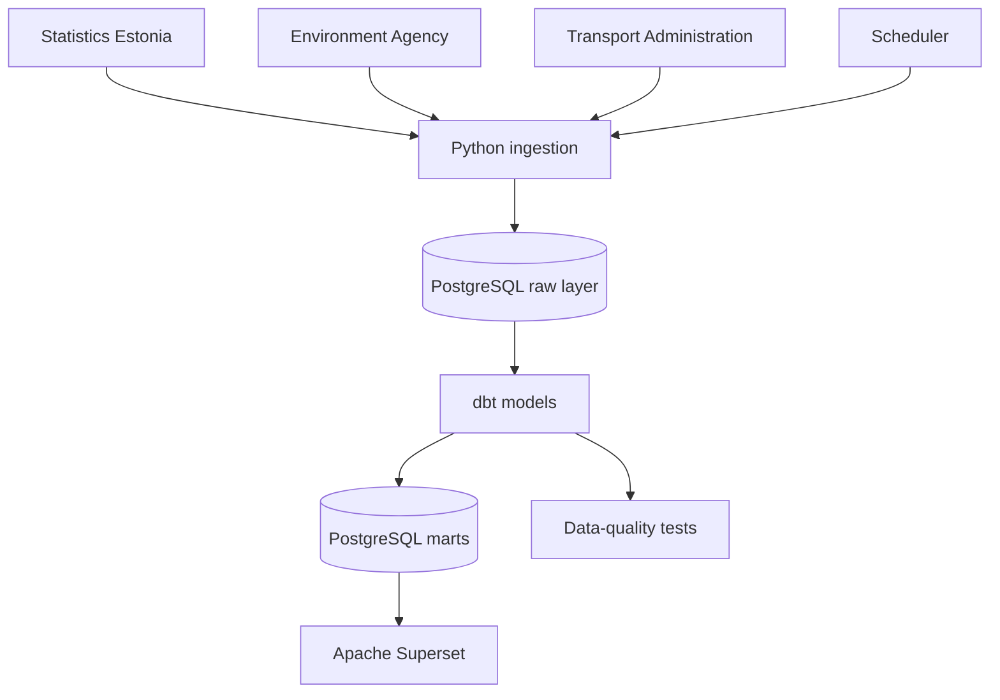
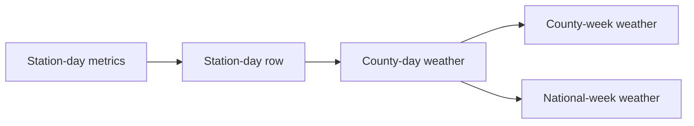
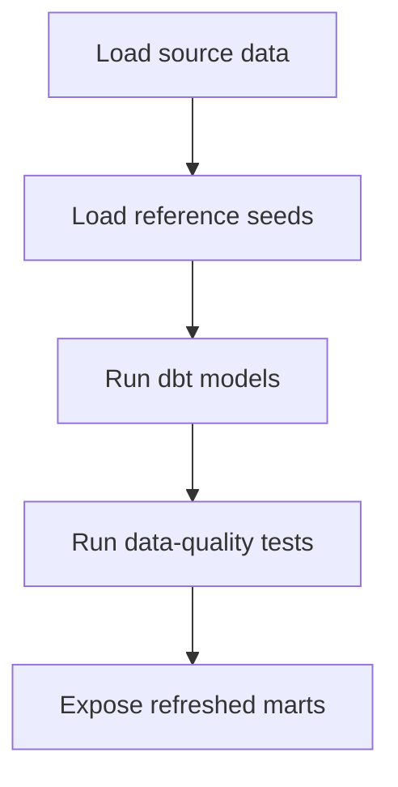

# Architecture

## Purpose

This document describes the planned architecture of my individual data engineering project on weather conditions, mortality and traffic accidents in Estonia. It explains what each component does, why it is needed and how data moves through the system.

## Design goals

The architecture should be:

- **reproducible:** another user should be able to run the project from documented steps;
- **modular:** ingestion, storage, transformation, testing and visualisation should have separate responsibilities;
- **traceable:** every dashboard measure should be traceable to a source and transformation rule;
- **idempotent:** rerunning the pipeline should not create duplicate records;
- **testable:** incorrect grains, missing values and invalid measures should be detected before dashboard refresh;
- **maintainable by one person:** the solution should remain understandable and operable without unnecessary infrastructure.

## System context

The system retrieves public data from three Estonian data providers. Python loaders write source data to PostgreSQL. dbt converts the source tables into consistent weekly datasets and runs data-quality tests. Apache Superset reads the final marts and presents the results.

## Component responsibilities

| Component | Responsibility | Why it is separate |
|---|---|---|
| Python ingestion | Requests source data, validates the response structure and loads raw tables | Keeps API-specific logic outside analytical SQL |
| PostgreSQL | Stores raw, intermediate and analytical data | Provides one durable relational store for dbt and Superset |
| dbt | Cleans, standardises, aggregates and joins the datasets | Makes SQL transformations modular, reviewable and testable |
| dbt tests | Verifies keys, grains, ranges, completeness and business rules | Prevents known data problems from reaching the dashboard |
| Scheduler | Starts pipeline steps in dependency order and records failures | Removes the need for manual refreshes while keeping orchestration simple |
| Apache Superset | Displays validated measures and filters | Keeps presentation logic separate from data preparation |
| Docker Compose | Defines and connects the local services | Creates a reproducible development environment |

## Data flow

### 1. Ingestion

Each source has its own Python loader because its API, response format and update behaviour are different.

The loaders should:

1. read connection settings from environment variables;
2. request data with explicit timeouts;
3. check HTTP status and expected fields;
4. parse the source format;
5. load data inside a database transaction;
6. record the ingestion time and, where possible, the source version;
7. fail clearly if the load is incomplete.

For the first version, a full reload is acceptable for small datasets. The replacement should be atomic: the existing table must not be removed until the new dataset has been downloaded and validated successfully. Incremental loading can be introduced later if data volume or API limits require it.

### 2. Raw layer

The raw layer preserves source values with minimal transformation. Technical metadata such as `loaded_at` and source identifiers should be added here.

Recommended raw tables:

| Table | Intended grain |
|---|---|
| `raw_surmad` | One row per source combination of year, ISO week, sex, age group and indicator |
| `raw_onnetused` | One row per traffic-accident event |
| `raw_ilm` | One row per station, date and weather metric |

Raw tables are not used directly by the dashboard.

### 3. Staging layer

Staging models isolate source-specific cleaning. They should:

- rename fields consistently;
- convert text values to dates and numbers;
- derive ISO year, ISO week and a shared `week_key`;
- normalize county, sex and age-group labels;
- retain only the indicators required by the project;
- expose invalid or unmapped values for testing.

Staging models should not contain dashboard-specific calculations.

### 4. Intermediate layer

Intermediate models align the sources to comparable grains.

For weather data, the planned path is:

This two-stage aggregation avoids giving counties with more weather stations a larger weight in the national result. The precise weighting rule must be documented; an unweighted county average and a station-weighted national average answer different questions.

Traffic accidents are aggregated from events to `county x ISO week`. Mortality is already published at a weekly national level and is standardised to `ISO week x sex x age group`.

Historical comparison models calculate the mean for the same ISO week in earlier years. Only years earlier than the row being evaluated may be included, so the comparison does not use future information.

### 5. Marts layer

The final analytical outputs are:

| Mart | Declared grain | Purpose |
|---|---|---|
| `mart_deaths_weather_weekly_national` | One row per ISO week, sex and age group | Compares mortality with national weather and historical same-week values |
| `mart_traffic_weather_weekly_county` | One row per ISO week and county | Compares traffic outcomes with county weather and historical same-week values |

Shared dimensions may include ISO week, county, sex, age group and weather station. Reusable fact models may be retained if they simplify lineage or support future marts.

Every mart must have an automated uniqueness test for its declared grain.

## Orchestration

The scheduler starts one pipeline run. The run order is:

A critical failure stops the run and returns a non-zero exit code. The pipeline must not continue after a failed source load unless the fallback behaviour is explicitly designed and the dashboard clearly shows the data timestamp.

For a single-person project, cron or another lightweight scheduler is sufficient. A larger orchestration platform would add operational complexity without a clear benefit at this stage.

## Data-quality controls

Tests are applied at several levels:

| Level | Example controls |
|---|---|
| Source/raw | Expected columns, successful row count, unique natural keys, load timestamp |
| Staging | Required typed fields, valid ISO weeks, accepted category values |
| Intermediate | Valid station-to-county mapping, observed-day bounds, non-negative measures |
| Marts | Unique declared grain, required foreign keys, no accidental row multiplication |

Freshness and partial-period handling are especially important. The current week may contain incomplete traffic or weather data, while mortality may be preliminary. These states should be represented explicitly rather than interpreted as true decreases.

## Idempotency and failure safety

Rerunning the same source period should produce the same logical rows. Full reloads may use a temporary table followed by a transactional swap. Incremental loads should use a documented natural key and an upsert strategy.

The ingestion code must not truncate or drop the current production table before a replacement dataset has been fetched and validated. This prevents a temporary API failure from leaving the project without data.

## Configuration and secrets

Non-sensitive defaults may live in version-controlled configuration files. Passwords and secret keys are read from `.env` or the runtime environment.

The repository should contain `.env.example` with variable names and placeholder values, but never the real `.env` file. Generated logs, database volumes, dbt build outputs and local credentials should also be excluded from version control.

## Privacy

The selected sources are public and do not require direct personal identifiers. Mortality data is aggregated. Traffic-accident data must still be reviewed before loading to ensure that unused location or event attributes do not create unnecessary privacy risk.

## Known constraints and design decisions

| Constraint or decision | Consequence |
|---|---|
| Mortality source has no county field | Mortality-weather analysis is national, not county-level |
| Weather stations are unevenly distributed | Aggregation and coverage indicators must be documented |
| Same-week historical averages use a limited number of years | Comparisons can be unstable and must include the number of historical years |
| Weekly aggregation is the shared analytical grain | Short events and within-week timing are not visible |
| Superset is the selected dashboard tool | Presentation should use marts rather than duplicate transformation logic in virtual datasets |
| The project is maintained by one person | Simplicity and clear documentation take priority over complex infrastructure |

## Planned improvements after the first version

- introduce atomic or incremental source loading;
- add source freshness and row-count monitoring;
- parameterise the analysis period instead of hard-coding years;
- validate the coverage of every county and weather station;
- add confidence intervals or other measures of uncertainty where appropriate;
- evaluate whether population-adjusted mortality measures are available;
- document dashboard measures and filter behaviour in one data dictionary.

